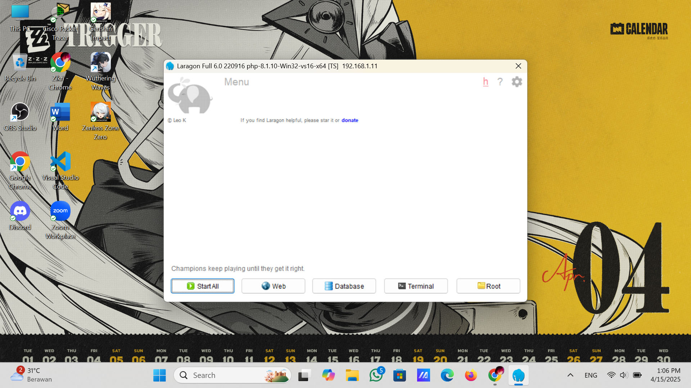
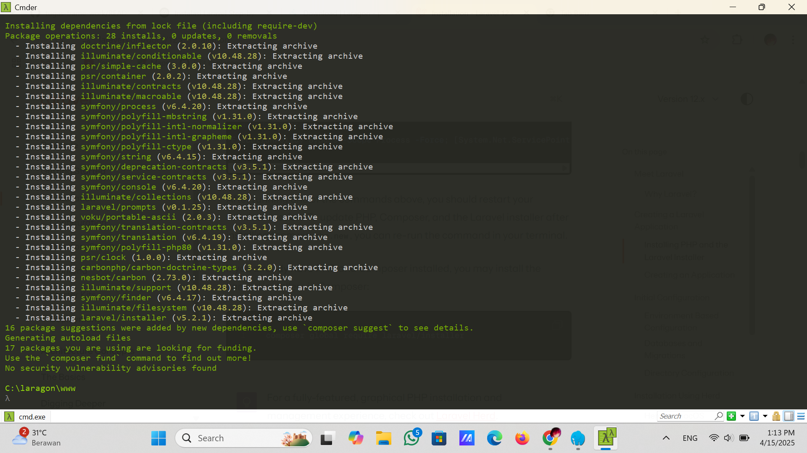

# Tugas-Frame-Work


# 📦 Tutorial Install Laragon, Laravel & Setup Upload Gambar

Dokumentasi ini menjelaskan langkah-langkah instalasi **Laragon**, **Laravel**, dan pembuatan direktori upload gambar di dalam project Laravel.

---

## 📥 Instalasi Laragon

1. Download **Laragon** dari situs resmi:  
   👉 [https://laragon.org/download/](https://laragon.org/download/)
   

3. Install Laragon seperti biasa (Next → Next → Finish).

4. Buka Laragon, klik **Start All**.
   

6. Pastikan `Apache` dan `MySQL` berjalan.

---

## 📥 Instalasi Laravel

### 1. Install Composer (Jika Belum)
Download dan install Composer dari:  
👉 [https://getcomposer.org/download/](https://getcomposer.org/download/)
Cek instalasi Composer:
```bash
composer --version


## 2. Install Laravel via Composer
Buka Terminal atau CMD lewat Laragon.

Masuk ke direktori C:\laragon\www



